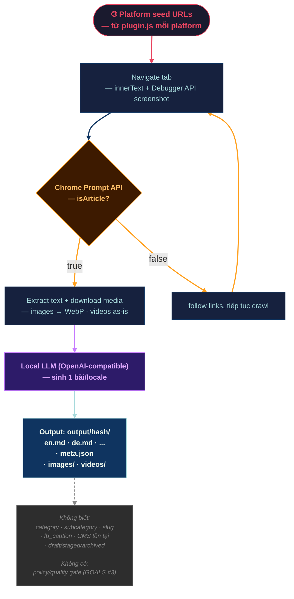
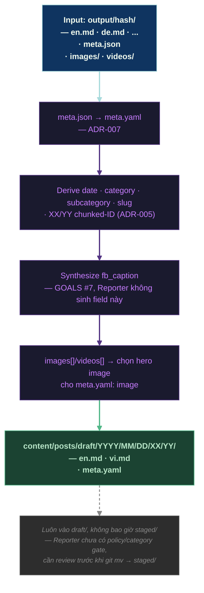
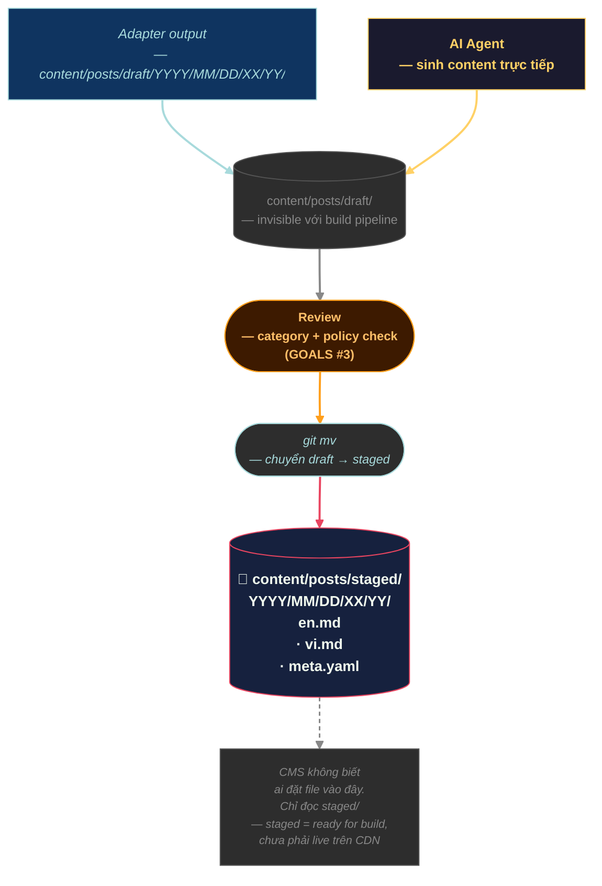
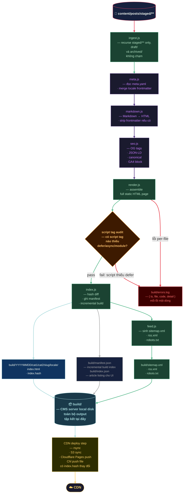

# Pipeline Map — Internet → CMS HTML

---

## Graph 1 — Toàn cảnh pipeline (bird's eye)

```mermaid
flowchart LR
    INTERNET(["🌐 Internet"]):::source
    REPORTER["🕷️ Reporter<br/>— crawl + classify<br/>+ local LLM generate"]:::reporter
    ADAPTER(["⇄ Adapter"]):::adapter
    CMS_PUB[("📁 staged/")]:::cms
    BUILD["🔨 Build Pipeline"]:::build
    BUILD_OUT[("📦 build/")]:::buildout
    DEPLOY["CDN deploy step"]:::deploy
    CDN(["☁️ CDN"]):::cdn

    INTERNET --> REPORTER
    REPORTER --> ADAPTER
    ADAPTER --> CMS_PUB
    CMS_PUB --> BUILD
    BUILD --> BUILD_OUT
    BUILD_OUT --> DEPLOY --> CDN

    classDef source   fill:#1a1a2e,stroke:#e94560,color:#e94560,font-weight:bold,font-size:15px
    classDef reporter fill:#16213e,stroke:#0f3460,color:#a8dadc,font-weight:bold,font-size:14px
    classDef adapter  fill:#0f3460,stroke:#a8dadc,color:#a8dadc,font-style:italic,font-size:13px
    classDef cms      fill:#16213e,stroke:#e94560,color:#f1faee,font-weight:bold,font-size:14px
    classDef build    fill:#1b4332,stroke:#52b788,color:#b7e4c7,font-weight:bold,font-size:14px
    classDef buildout fill:#1a3a4a,stroke:#a8dadc,color:#a8dadc,font-weight:bold,font-size:13px
    classDef deploy   fill:#2d2d00,stroke:#ffd166,color:#ffd166,font-size:13px
    classDef cdn      fill:#1a1a2e,stroke:#ffd166,color:#ffd166,font-weight:bold,font-size:15px

    linkStyle 0 stroke:#e94560,stroke-width:2px
    linkStyle 1 stroke:#0f3460,stroke-width:2px
    linkStyle 2 stroke:#a8dadc,stroke-width:2px
    linkStyle 3 stroke:#e94560,stroke-width:2px
    linkStyle 4 stroke:#52b788,stroke-width:2px
    linkStyle 5 stroke:#a8dadc,stroke-width:2px
    linkStyle 6 stroke:#ffd166,stroke-width:2px
```

---

## Graph 2 — Reporter layer

---

## Graph 3 — Adapter layer (Reporter → CMS, chưa có code)

---

## Graph 4 — Publisher layer (ai đặt file vào staged/)

---

## Graph 5 — CMS Build Pipeline

---

## Ranh giới trách nhiệm

| Layer        | Biết gì                                   | Không biết gì                                            |
| ------------ | ----------------------------------------- | -------------------------------------------------------- |
| **Reporter** | URL nguồn, raw content, đa locale         | category · subcategory · slug · fb_caption · CMS tồn tại |
| **Adapter**  | Reporter output format + CMS input format | category/policy judgment (cần review riêng)              |
| **CMS**      | `content/posts/staged/`                   | Reporter · Adapter · content đến từ đâu                  |

> `GOALS #3`, `GOALS #7` (xuất hiện trong Graph 2–4 ở trên) — xem [00_GOALS.md](00_GOALS.md), numbering #1–16.
